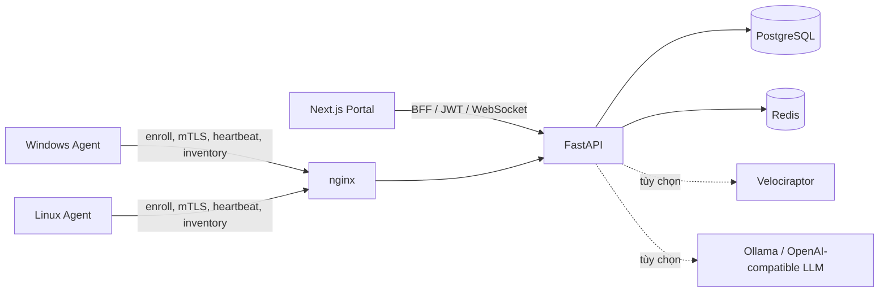

# IT Asset Inventory

Hệ thống quản lý tài sản CNTT theo mô hình **Agent – Server**, dùng để kiểm kê phần cứng, phần mềm, trạng thái an toàn thông tin và hỗ trợ điều tra số tập trung.

> **Đơn vị phát triển:** Phòng An ninh mạng và phòng, chống tội phạm sử dụng công nghệ cao, Công an tỉnh Hà Tĩnh.

## Tổng quan

Repository này là monorepo gồm ba thành phần chính:

- **API Server:** FastAPI, PostgreSQL, Redis, Alembic; cung cấp API cho agent và portal.
- **Portal quản trị:** Next.js App Router, TypeScript, React và Tailwind CSS; sử dụng mô hình BFF để giữ JWT trong cookie `httpOnly`.
- **Agent:** .NET 8 cho Windows Service và Linux systemd; thu thập dữ liệu theo hướng read-only, hỗ trợ mTLS, lưu tạm khi mất mạng và đồng bộ cấu hình từ server.



## Tính năng chính

- Enroll agent bằng token dùng một lần; heartbeat, inventory, gia hạn chứng chỉ và rescan từ xa.
- Kiểm kê CPU, RAM, ổ đĩa, mạng, hệ điều hành, phần mềm, startup, cổng mạng và security posture.
- Dashboard realtime, thống kê cấu hình, vòng đời tài sản, máy mất kết nối, EOL, tag và so sánh thay đổi fingerprint.
- Quản lý người dùng và phân quyền theo cây tổ chức (`super_admin`, `org_admin`, `viewer`).
- 2FA TOTP, JWT access/refresh token, audit log hash chain, mã hóa AES-256-GCM và API key cho tích hợp ngoài.
- Xuất báo cáo Excel/PDF, thông báo, alert rule và import dữ liệu từ máy cách ly.
- Tích hợp Velociraptor cho DFIR; hỗ trợ phân tích bằng LLM cục bộ hoặc API tương thích OpenAI.

## Cấu trúc repository

| Đường dẫn | Nội dung |
|---|---|
| [`server/`](server/) | FastAPI, model dữ liệu, migration, background services và Docker Compose cho hạ tầng |
| [`portal/`](portal/) | Portal Next.js, BFF route handlers và giao diện quản trị |
| [`agent/`](agent/) | Agent .NET 8, test, MSI và package Linux `.deb`/`.rpm` |
| [`deepagent/`](deepagent/) | Orchestrator LangGraph truy vấn Velociraptor qua MCP và callback báo cáo DFIR |
| [`deploy/`](deploy/) | Chứng chỉ dev, step-ca và stack Velociraptor |
| [`docs/`](docs/) | API contract, schema inventory, runbook và tài liệu DFIR/LLM |
| [`build-all.sh`](build-all.sh) | Kiểm tra build cả server, agent và portal |

Contract giao tiếp giữa Backend, DeepAgent LangGraph và Velociraptor MCP: [`docs/DEEPAGENT_CONTRACT.md`](docs/DEEPAGENT_CONTRACT.md).

## Yêu cầu phát triển

- Python **3.12+**
- Node.js **22+** và npm
- .NET SDK **8.0**
- Docker Engine và Docker Compose plugin
- PostgreSQL 16 và Redis 7 có thể chạy bằng Docker, không cần cài trực tiếp

Chỉ cần Python, Node.js và Docker nếu chưa phát triển agent.

## Chạy nhanh môi trường dev

### 1. Khởi động PostgreSQL và Redis

Từ thư mục gốc của repository:

```bash
docker compose -f server/deploy/docker-compose.yml up -d postgres redis
```

PostgreSQL lắng nghe tại `localhost:5432`; Redis được expose tại `localhost:6381`.

### 2. Cấu hình và chạy API

```bash
cd server
cp .env.example .env
python3.12 -m venv .venv
.venv/bin/python -m pip install -e ".[dev]"
.venv/bin/alembic upgrade head
.venv/bin/uvicorn app.main:app --reload
```

Trước khi dùng ngoài môi trường dev, hãy thay các giá trị `CHANGE_ME` trong `server/.env`. Có thể kiểm tra API tại:

- Health check: <http://127.0.0.1:8000/health>
- OpenAPI/Swagger UI: <http://127.0.0.1:8000/docs>

Trong `APP_ENV=dev`, server tự seed tài khoản quản trị theo `SEED_ADMIN_*`. Mặc định trong file mẫu là:

```text
admin@example.gov.vn / ChangeMe!123
```

Hãy đổi mật khẩu ngay khi khởi tạo môi trường dùng chung.

### 3. Chạy Portal

Mở terminal khác:

```bash
cd portal
cp .env.local.example .env.local
npm ci
npm run dev
```

Portal mặc định chạy tại <http://localhost:3000> và BFF kết nối tới `API_BASE=http://localhost:8000`.

### 4. Chạy thử Agent

```bash
cd agent
dotnet build -c Release
dotnet run --project src/OrgInventoryAgent -c Release -- \
  --data-dir ./tmp-data --print-fingerprint
```

Khi đã tạo enroll token trên Portal, có thể chạy agent một lần ở console. Trước đó, đặt `AGENT_SERVER_URL=http://localhost:8000` trong `server/.env` và khởi động lại API để agent tiếp tục sử dụng endpoint local sau khi enroll.

```bash
dotnet run --project src/OrgInventoryAgent -c Release -- \
  --data-dir ./tmp-data \
  --endpoint http://localhost:8000 \
  --enroll-token '<TOKEN>' \
  --once
```

Agent production được cài dưới dạng Windows Service hoặc Linux systemd service. Xem [hướng dẫn Agent](agent/README.md) và [runbook](docs/RUNBOOK.md) trước khi đóng gói/triển khai.

## Cấu hình quan trọng

Server đọc cấu hình từ `server/.env`; Portal đọc từ `portal/.env.local`.

| Biến | Ý nghĩa |
|---|---|
| `DATABASE_URL` | Kết nối PostgreSQL async qua `asyncpg` |
| `REDIS_URL` | Redis cho trạng thái online và realtime pub/sub |
| `SECRET_KEY` | Khóa ký JWT |
| `DATA_ENCRYPTION_KEY` | Khóa mã hóa dữ liệu nhạy cảm |
| `CA_MODE` | `local` cho dev/test; `stepca` cho CA nội bộ |
| `AGENT_SERVER_URL` | URL công khai agent sử dụng sau enroll |
| `PORTAL_URL` | URL công khai của Portal |
| `HEARTBEAT_INTERVAL_SECONDS` | Chu kỳ heartbeat do server phân phối cho agent |
| `VELOCIRAPTOR_ENABLED` | Bật tích hợp DFIR Velociraptor |
| `LLM_ENABLED` | Bật trợ lý phân tích DFIR bằng LLM |
| `API_BASE` | Backend FastAPI mà BFF của Portal sử dụng |

Danh sách đầy đủ và giá trị mẫu nằm trong [`server/.env.example`](server/.env.example) và [`portal/.env.local.example`](portal/.env.local.example).

## Kiểm tra chất lượng

Chạy riêng từng thành phần:

```bash
# Server
(cd server && .venv/bin/ruff check app && .venv/bin/pytest -q)

# Portal
(cd portal && npm run typecheck && npm run build)

# Agent
(cd agent && dotnet test -c Release && dotnet build -c Release)
```

Hoặc kiểm tra build toàn repository:

```bash
./build-all.sh
```

GitHub Actions tự động chạy lint/test server, build agent trên Linux và Windows, sau đó typecheck/build Portal cho mỗi push hoặc pull request vào `main`.

## Triển khai

File [`server/deploy/docker-compose.yml`](server/deploy/docker-compose.yml) cung cấp PostgreSQL, Redis, API, nginx và profile step-ca. Trong dev, nên dùng Compose cho PostgreSQL/Redis và chạy API/Portal từ source như phần quick start.

Triển khai production cần chuẩn bị thêm:

- image API và artifact Agent đã được build/ký;
- TLS server, client CA, CRL và step-ca;
- secret từ secret manager/Vault thay cho file mẫu;
- volume bền vững, backup PostgreSQL và quy trình restore;
- domain tách biệt cho Portal và kênh mTLS của Agent;
- `REQUIRE_AGENT_MTLS_HEADER=true` khi FastAPI đặt sau nginx đã xác thực client certificate.

Không dùng nguyên cấu hình dev hoặc các secret mặc định cho production.

## Tài liệu

- [API contract](docs/API_CONTRACT.md)
- [Runbook triển khai và vận hành](docs/RUNBOOK.md)
- [Schema inventory v4](docs/INVENTORY_V4_SCHEMA.md)
- [Payload inventory của Agent](docs/AGENT_INVENTORY_PAYLOAD_SPEC.md)
- [Cơ chế đồng bộ cấu hình Agent](docs/AGENT_CONFIG_SYNC.md)
- [Cài đồng thời OrgInventory Agent và Velociraptor](docs/INSTALL_BOTH_AGENTS.md)
- [Tổng quan LLM cho DFIR](docs/llm-dfir/00_TONG_QUAN.md)
- [Triển khai DeepAgent LangGraph](deepagent/README.md)
- [Thiết kế hệ thống](KE_HOACH_HE_THONG_QUAN_LY_MAY_TINH.md)
- [Kế hoạch thực hiện](PLAN_THUC_HIEN.md)

## Ghi chú bảo mật

- Không commit `.env`, private key, client certificate, token enroll, backup code 2FA hoặc artifact điều tra.
- Private key của agent được sinh và lưu tại máy trạm; không gửi lên server.
- Endpoint Agent production phải đi qua reverse proxy mTLS; Portal dùng TLS thông thường kèm JWT/RBAC.
- Chỉ cho phép các Velociraptor artifact trong allowlist và luôn duy trì audit log cho thao tác DFIR.
