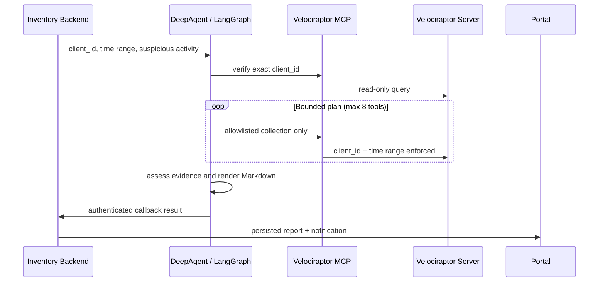

# DeepAgent DFIR

`DeepAgent DFIR` là service LangGraph tách biệt cho hệ thống IT Asset Inventory. Service nhận một investigation có `client_id`, thời gian và dấu hiệu nghi ngờ từ backend; dùng [mcp-velociraptor](https://github.com/lephuhung/mcp-velociraptor) để truy vấn Velociraptor; sau đó callback báo cáo Markdown về investigation của backend.

Phiên bản đầu tiên khóa workflow vào các helper read-only của Windows (`process`, `network`, `persistence`, `event log`, `PowerShell` và execution evidence). Linux/macOS sẽ được thêm bằng catalog riêng sau khi chốt mapping artifact theo từng hệ điều hành.

## Luồng xử lý



## Boundary an toàn

- LangGraph chỉ được phép gọi tool trong allowlist read-only. Các tool `run_vql`, hunt, `collect_artifact`, file collection, YARA, quarantine và `kill_process` không có trong graph.
- `client_id`, `org_id`, `DateAfter` và `DateBefore` do code chèn vào. Mô hình không thể thay thế chúng.
- Kế hoạch tối đa 8 bước; lỗi một truy vấn được ghi là hạn chế, không xóa bằng chứng đã có.
- Log, command line, event message, filename và phần mô tả sự kiện đều được coi là dữ liệu không tin cậy, không phải chỉ dẫn cho agent.
- Callback chỉ gửi về `DEEPAGENT_BACKEND_URL` cố định với API key `investigation:write`; URL callback không nhận từ người dùng.

## Cài đặt

```bash
cd deepagent
cp .env.example .env
python3.12 -m venv .venv
.venv/bin/python -m pip install -e ".[dev]"
```

Chuẩn bị MCP Velociraptor riêng theo hướng dẫn của [mcp-velociraptor](https://github.com/lephuhung/mcp-velociraptor): tạo `api_client.yaml`, cài dependencies và trỏ `DEEPAGENT_MCP_COMMAND`, `DEEPAGENT_MCP_ARGS_JSON`, `DEEPAGENT_MCP_ENV_JSON` vào bridge. Giữ `ENABLE_DANGEROUS_TOOLS=false`.

Tạo API key backend có duy nhất scope `investigation:write`, rồi đặt nó vào `DEEPAGENT_BACKEND_API_KEY`. Đây là credential callback; không truyền key này qua request job hoặc commit vào Git.

Khởi chạy:

```bash
cd deepagent
.venv/bin/uvicorn deepagent.api:app --host 0.0.0.0 --port 8090
```

## Kết nối Inventory Backend

Trong `server/.env`:

```dotenv
LLM_EXTERNAL_ORCHESTRATOR=deepagent
DEEPAGENT_ENABLED=true
DEEPAGENT_URL=http://127.0.0.1:8090
DEEPAGENT_API_KEY=<DEEPAGENT_SERVICE_TOKEN>
DEEPAGENT_DEFAULT_LOOKBACK_HOURS=24
```

Sau đó đặt `external_orchestrator` thành `deepagent` trong cấu hình LLM qua Portal/API. Khi Super Admin bấm **Điều tra AI**, backend tạo investigation, dispatch bất đồng bộ sang DeepAgent và Portal tiếp tục đọc báo cáo Markdown từ investigation hiện hữu. Không cần truy vấn qua Velociraptor UI.

## API

`POST /v1/investigations` yêu cầu `Authorization: Bearer <DEEPAGENT_SERVICE_TOKEN>` và trả `202 Accepted`. Backend gửi payload:

```json
{
  "schema_version": "dfir.deepagent.request/1.0",
  "investigation_id": "11111111-1111-4111-8111-111111111111",
  "client_id": "C.0123456789abcdef",
  "hostname": "WS-01",
  "time_range": {
    "from": "2026-08-31T00:00:00Z",
    "to": "2026-08-31T23:59:59Z"
  },
  "suspicious_activity": "Nghi ngờ thực thi PowerShell bất thường"
}
```

Theo dõi job bằng `GET /v1/jobs/{job_id}`. Kết quả chính thức luôn nằm ở `GET /api/admin/llm-dfir/investigations/{id}` của backend.

## Kiểm thử

```bash
cd deepagent
.venv/bin/ruff check deepagent tests
.venv/bin/pytest -q
```
