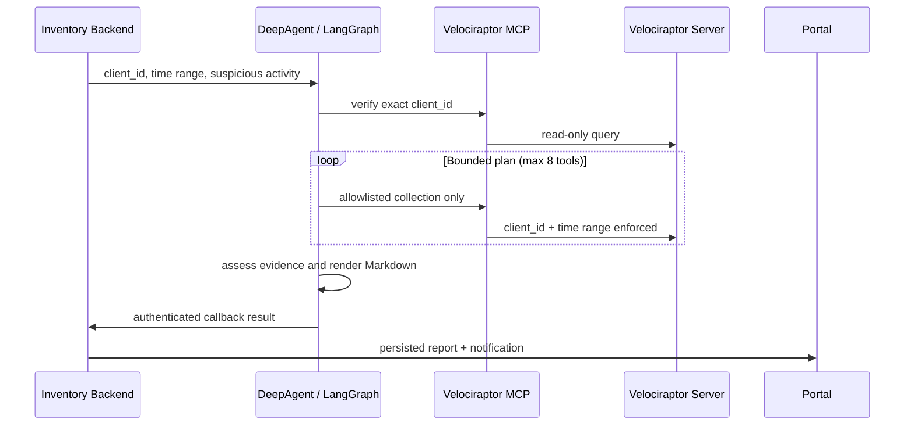

# DeepAgent DFIR

`DeepAgent DFIR` là service LangGraph tách biệt cho hệ thống IT Asset Inventory. Service nhận một investigation có `client_id`, thời gian và dấu hiệu nghi ngờ từ backend; dùng [mcp-velociraptor](https://github.com/lephuhung/mcp-velociraptor) để truy vấn Velociraptor; sau đó callback báo cáo Markdown về investigation của backend.

Phiên bản đầu tiên khóa workflow vào các helper read-only của Windows (`process`, `network`, `persistence`, `event log`, `PowerShell` và execution evidence). Linux/macOS sẽ được thêm bằng catalog riêng sau khi chốt mapping artifact theo từng hệ điều hành.

## Luồng xử lý



## Boundary an toàn

- LangGraph chỉ được phép gọi tool trong allowlist read-only. Các tool `run_vql`, hunt, `collect_artifact`, file collection, YARA, quarantine và `kill_process` không có trong graph.
- `client_id`, `org_id`, `DateAfter` và `DateBefore` do code chèn vào. Mô hình không thể thay thế chúng.
- Kế hoạch tối đa 8 bước; lỗi một truy vấn được ghi là hạn chế, không xóa bằng chứng đã có.
- Log, command line, event message, filename và phần mô tả sự kiện đều được coi là dữ liệu không tin cậy, không phải chỉ dẫn cho agent.
- Callback chỉ gửi về `DEEPAGENT_BACKEND_URL` cố định với API key `investigation:write`; URL callback không nhận từ người dùng.

### Phân loại Tier 1 / Tier 2 (defense-in-depth)

Custom artifact do backend ký phát qua trường `custom_artifacts[]` của investigation request. Mỗi artifact có 3 field:

| Field | Bắt buộc | Mục đích |
|---|---|---|
| `name` | ✓ | Tên artifact Custom.* |
| `supported_platforms` | ✓ | Danh sách OS hỗ trợ (windows / linux / macos). Bắt buộc để backend khai báo OS coverage. |
| `tier` | (mặc định 2) | Tier classification |

**Tier 1 (initial collection)** yêu cầu **đồng thời** 3 điều kiện — DB compromise alone không đủ:

1. `ref.tier == 1` (admin phải promote tier trong DB)
2. `ref.name` thuộc hardcoded `TIER1_CUSTOM_TOOLS[platform]` whitelist — không thể promote Custom.* ngoài whitelist lên Tier 1
3. `target_platform in ref.supported_platforms` — Linux artifact không chạy trên Windows investigation

Legacy fallback: nếu request không có tier=1 attempt (pre-A2 backend), dùng hardcoded whitelist. Khi DB đã supply tier=1 nhưng fail whitelist → KHÔNG fallback (vì DB đã khẳng định explicit "không có tier=1 hợp lệ").

**Tier 2 (post-Tier-1 expansion)** yêu cầu:

1. `ref.tier == 2`
2. `target_platform in ref.supported_platforms` — Linux artifact không leak vào Windows investigation

Admin promote Custom.* mới lên Tier 2 qua cột `tier` trong bảng `velociraptor_artifacts` (DB) mà không cần rebuild image. Tier 1 vẫn cần cập nhật code để thêm vào whitelist (Tier 1 chạy ngay đầu investigation, nhạy cảm nhất).

### Phân loại lỗi và an toàn thông tin

Khi investigation fail, error message được phân loại và suppress nội dung raw để tránh leak prompt fragment hoặc evidence. Portal nhận format `[<category>] <hint> [HTTP <code>]`, ví dụ:

```
[llm_timeout] LLM backend timeout. Kiểm tra kết nối tới LLM endpoint và xem xét tăng `DEEPAGENT_LLM_TIMEOUT_SECONDS`.
```

| Category | Khi nào | Hướng xử lý (hint) |
|---|---|---|
| `llm_timeout` | LLM request hết giờ timeout | Tăng `DEEPAGENT_LLM_TIMEOUT_SECONDS` |
| `llm_unreachable` | Không kết nối được LLM backend | Kiểm tra base_url và network |
| `llm_output_truncated` | LLM trả về vượt `max_tokens` | Tăng max_tokens trong `llm_config` |
| `llm_content_filtered` | LLM từ chối do content filter | Kiểm tra prompt và dữ liệu đầu vào |
| `llm_rate_limited` | Rate limit (429) | Đợi rồi retry |
| `llm_bad_request` | 4xx từ LLM | Kiểm tra prompt, schema, context window |
| `llm_forbidden` | 401/403 | Kiểm tra API key |
| `llm_server_error` | 5xx từ LLM | Kiểm tra upstream |
| `mcp_timeout` | Velociraptor MCP tool timeout | Tăng `DEEPAGENT_MCP_TOOL_TIMEOUT_SECONDS` |
| `mcp_policy` | MCP policy violation | Kiểm tra allowlist Tier 1/Tier 2 |
| `velociraptor_push` | Artifact Custom.* không push được | Kiểm tra artifact definition + push status |
| `internal` | Các lỗi khác | Xem log chi tiết container |

Raw exception message **không bao giờ** được expose về portal — chỉ exception class name, HTTP status code, và static hint string được phép rò rỉ.

## Cài đặt

DeepAgent được Docker Compose khởi động cùng Backend và Portal. Image tự đóng gói commit đã khóa của [mcp-velociraptor](https://github.com/lephuhung/mcp-velociraptor) trong Python environment riêng, nên dependencies của bridge không xung đột với LangGraph.

Đặt `DEEPAGENT_SERVICE_TOKEN` là chuỗi ngẫu nhiên mạnh trong `server/.env` trước khi chạy Compose. Đây là credential nội bộ giữa Backend và DeepAgent; không truyền qua Portal. Nếu dùng callback kết quả, tạo API key scope `investigation:write` và đặt vào `DEEPAGENT_BACKEND_API_KEY`.

## Kết nối Inventory Backend

Trong Portal, mở **Quản trị → LLM & DFIR → DeepAgent & Velociraptor MCP**, bật DeepAgent khi muốn investigation mới dùng LangGraph, rồi bấm **Kiểm tra MCP → Velociraptor**. URL container và service token do Compose quản lý. Backend lấy `api_client.yaml` đã mã hóa từ cấu hình Velociraptor, gửi nó chỉ qua Docker network tới DeepAgent và xóa tệp tạm ngay sau khi bridge hoàn tất.

## API

`POST /v1/investigations` yêu cầu `Authorization: Bearer <DEEPAGENT_SERVICE_TOKEN>` và trả `202 Accepted`. Backend gửi payload:

```json
{
  "schema_version": "dfir.deepagent.request/1.0",
  "investigation_id": "11111111-1111-4111-8111-111111111111",
  "client_id": "C.0123456789abcdef",
  "hostname": "WS-01",
  "time_range": {
    "from": "2026-08-31T00:00:00Z",
    "to": "2026-08-31T23:59:59Z"
  },
  "suspicious_activity": "Nghi ngờ thực thi PowerShell bất thường"
}
```

Theo dõi job bằng `GET /v1/jobs/{job_id}`. Kết quả chính thức luôn nằm ở `GET /api/admin/llm-dfir/investigations/{id}` của backend.

`POST /v1/mcp/test` cũng yêu cầu service token và nhận `velociraptor_api_client_yaml` chỉ trong request nội bộ. Endpoint chỉ nạp MCP tools và gọi `list_clients` với `limit=1`; nó không tạo hunt, không thu thập file và không chạy VQL tùy ý.

## Kiểm thử

```bash
cd deepagent
.venv/bin/ruff check deepagent tests
.venv/bin/pytest -q
```

## Dung lượng hàng đợi (Capacity)

DeepAgent hỗ trợ xử lý song song nhiều investigation thông qua semaphore có dung lượng giới hạn:

| Biến môi trường | Phạm vi | Mặc định | Mô tả |
|---|---|---|---|
| `DEEPAGENT_MAX_CONCURRENT_JOBS` | 1–3 | 2 | Số investigation chạy đồng thời |

Khi đạt dung lượng tối đa, investigation mới được xếp vào hàng đợi FIFO theo `created_at ASC`. Job giữ trạng thái `queued` cho đến khi semaphore cho phép bắt đầu.

### Thay đổi dung lượng

```bash
# Chỉnh sửa biến môi trường trong .env
DEEPAGENT_MAX_CONCURRENT_JOBS=3

# Rebuild và recreate service
docker compose -p asset-inventory -f server/deploy/docker-compose.yml up -d --build deepagent
```

## Giới hạn vận hành

| Giới hạn | Giá trị | Mô tả |
|---|---|---|
| Bước tối đa (triage) | 6 | Số bước plan ban đầu |
| Bước chi tiết tối đa | 2 | Số lần gọi detail sau triage |
| Dòng event log tối đa | 50 | Mỗi trang detail |
| Metadata event log | 100 dòng | Kết quả triage đầu tiên |
| Thời gian cửa sổ detail | 60 phút | Giới hạn mỗi expansion |
| Ngân sách bằng chứng | 120.000 ký tự | Tổng evidence JSON |
| Timeout tool | 180 giây | MCP bridge deadline |
| `max_tokens` (Tier 1 plan) | 8.000 | Qwen3.6 reasoning overhead |
| `max_tokens` (Tier 2 plan) | 16.000 | Tier 2 prompt lớn hơn |
| `max_tokens` (event log detail) | 1.500 | Output nhỏ, structured |
| `max_tokens` (assess report) | 8.000 | Markdown report |
| `max_retries` (OpenAI client) | 0 | Fail fast, không retry ngầm |

**Tại sao per-call `max_tokens`?** Qwen3.6-35B là reasoning model — emit nhiều pre-answer text trước khi ra JSON. `max_tokens=64000` (default cũ) cho phép runaway → timeout 6 phút do retry ngầm. Per-call cap vừa đủ cho structured output, vừa fail-fast khi LLM không stop.

**Tại sao `max_retries=0`?** Langchain-openai default retry 2 lần. Khi timeout → 3× wall-clock (361 giây). Pin `max_retries=0` để fail nhanh và log error_category để operator biết phải xử lý thế nào.

## Progress callback an toàn

Progress callback chỉ gửi các trường an toàn, không bao gồm dữ liệu nhạy cảm:

- `phase`: `running` → `collecting` → `finalizing` → hoàn thành
- `progress_percent`: 0–100
- `current_step` / `total_steps`: số bước (không có event ID thực)
- `message`: chỉ mô tả tiến trình (không có filter/logs/prompts thực)
